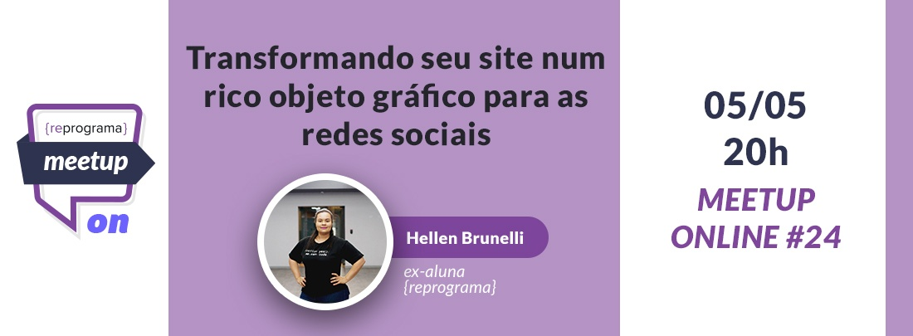

# Open Graph Protocol
Minha primeira palestra online realizada no dia 05/05/2020.



**24° [Meetup](https://reprograma.com.br/meetup/) online da [Reprograma](https://reprograma.com.br/).**


***" Resolvi falar sobre Open Graph, pois quando precisei implemetar, fiz inúmeras buscas, no meu caso era para Vtex, mas no geral, mesmo pessoas que já programavam a um bom tempo, não sabiam do que se tratava. 
Várias outras pessoas já me disseram que não sabiam o que era e muitas ja fizeram mas nem sabia que se tratava de um protocolo.
Open Graph serve para destacar seu conteúdo nas redes sociais, seja ele um site, ecommerce ou até mesmo seu portfólio."***


<br>

Trecho código usado como exemplo durante o mettup:

```html
    <!--START: Open Graph -->
    <meta property="og:title" content="Nome do seu site, loja etc.." />
    <meta property="og:description" content="Breve descrição do seu site" />
    <meta property="og:type" content="website" />
    <meta property="og:url" content="link do seu site" />
    <meta property="og:locale" content="pt_BR" />
    <meta property="og:image" content="link da imagem" />
    <!--END: Open Graph -->
```

<br>

## **Links de referências:**

### Documentação oficial [Open Graph Protocol](https://ogp.me/)

> Facebook e twitter cards, este artigo explora cada metatag e suas propriedades:
[Rockcontent](https://rockcontent.com/blog/meta-tags-para-redes-sociais/)

> Referência para tamanho de imagens:
[Roei's Tips Stream](https://roei.stream/2018/11/18/ideal-open-graph-image-size-for-whatsapp-link-share/)

> Referência tamanho de imagem para linkedin e Watsapp:
[Linkedin](https://www.linkedin.com/help/linkedin/answer/46687/making-your-website-shareable-on-linkedin?lang=en)

<br>

## ***Dica de ouro:***

Para que sua imagem do open graph apareça no watsapp, ela não pode ter mais de 5mb e deve ser uma imagem otimizada. Seguindo o padrão de imagem do Linkedin(citado na referência acima), assim você obterá um bom resultado também no watsapp.

<br>

## **Dica Para quem usa Vtex**

Na Vtex a implementação pode ser manual nas páginas, porém para a página de produto existe um controler específico que você pode consultar [aqui](https://help.vtex.com/tutorial/list-of-controls-for-templates--tutorials_563)

É importante ler para saber onde implementar manualmente e onde usar controlers.

Esse controle adiciona tags específicas para compartilhar informações com redes sociais (microformatos do Google, Facebook Open Graph e cartão do Twitter). As ferramentas de teste são:
<br>


```html
<vtex.cmc: productRichSnippets />
```

| Propriedades   |    Possíveis valores             |
|----------------|:---------------------------------|
| showGoogle     |  {"1", "true", "on", "sim"}      |
| showFacebook   |    {"1", "true", "on", "sim"}    |
| Twitter        | @accountname da conta do Twitter |
| doNotshowPrice |    {"1", "true", "on", "sim"}    |
| googleRate     |    {"1", "true", "on", "sim"}    |
| fbAdmins       |                                  |
| fbAppId	     |   

<br>

|Exemplo de uso | Código da peça |
|----------------|:--------------------------------:|
|Para que um produto seja indexado pelo Google, o controle deve ser inserido no corpo da tag|<vtex.cmc: productRichSnippets showGoogle = "1" /> |
|No caso do Facebook, ele deve ser inserido na tag head|<vtex.cmc: productRichSnippets showFacebook =Controles para páginas de departamento, categoria e pesquisa "1" fbAdmins = "[fbAdmins]" fbAppId = "[fbAppId]" /> (as configurações do fbAdmins e fbAppId são opcionais.)|
|Para o Twitter, ele pode ser inserido na cabeça ou no corpo | <vtex.cmc: productRichSnippets Twitter = "[TwitterAccount]" />|
|As configurações também podem ser agrupadas | <vtex.cmc: productRichSnippets showGoogle = "1" Twitter = "[TwitterAccount]" />

<br>

### **Controles para páginas de departamento, categoria e pesquisa entre outras informações você consegue visualizar [aqui](https://help.vtex.com/tutorial/list-of-controls-for-templates--tutorials_563).**

<br>

> <strong>Em VTEX quando você vai implementar em páginas institucionais, ou qualquer outra que seja depois do /
> 
> Ex: www.meusite.com.br/institucional <br>
> Ex: www.meusite.com.br/trabalhe-conosco <br>
> Sua url é direcionada para o link raiz ( www.meusite.com.br)<br>
> Se vc quiser especificar seu link, deverá usar a tag canonical </strong>

<br>

```html
<vtex.cmc: canonicalPage disable = "true" />
```
Se tiver dúvidas sobre ela, vou deixar um artigo bem legal e bem simples [aqui](https://help.vtex.com/known-issues/canonical-tag-on-custom-pages--70PufEhKCcgmOQo6CkAEAc) para vocês.


<br>

## **Para quem usa Wordpress**

O wordpress tem um plugin que vai facilitar sua vida, você consegue saber mais [aqui](https://wordpress.org/plugins/wp-open-graph/)

<br>


### **Ferramentas para depurar:**

- [Depurador Facebook](https://developers.facebook.com/tools/debug/)

- [Depurador linkedin](https://www.linkedin.com/post-inspector/)

- [Depurador Twitter](https://cards-dev.twitter.com/validator)

<br>


## **Outras ferramentas legais:**

Compactador de imagens PNG e JPG, eu gostei bastante do resultado.
- [Website Planet](https://www.websiteplanet.com/pt-br/webtools/imagecompressor/)


<br>

## ***Qualquer dúvida saiba onde me encontrar..***

- [Meu Linkedin](https://www.linkedin.com/in/hellenbrunelli/)

- [Meu Github](https://github.com/HellenBrunelli)


